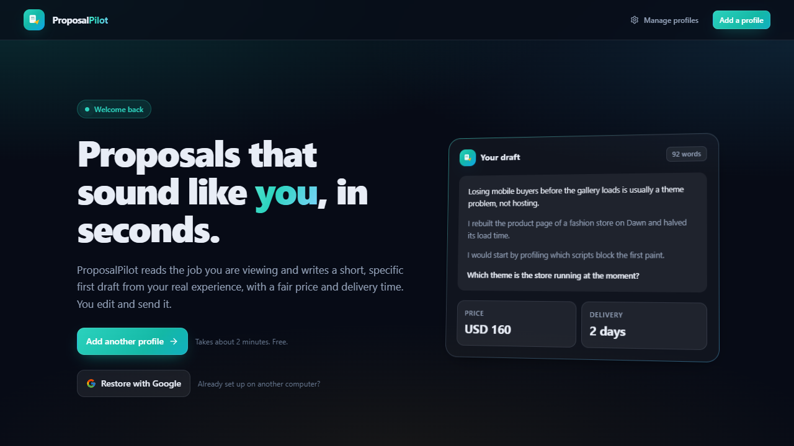
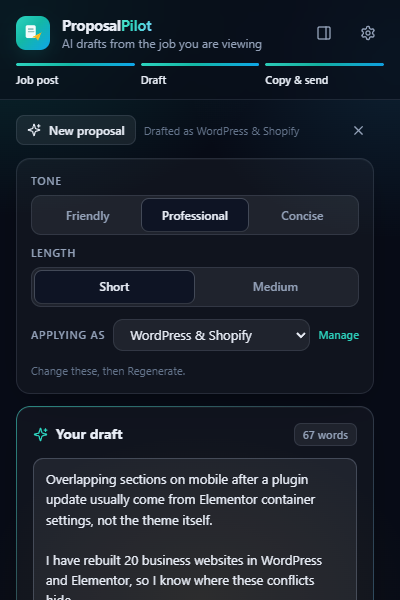
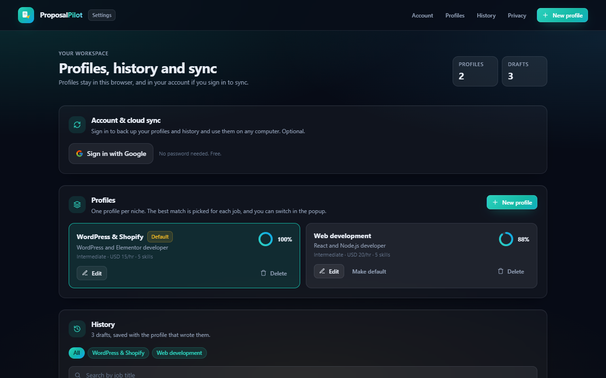
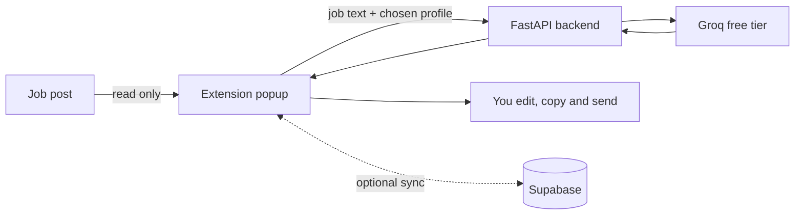

<div align="center">


# ProposalPilot

**AI-written first drafts for freelance proposals, right from the job post you are reading.**

[](https://github.com/shayan9689/Browser-extension-for-freelancers/actions/workflows/ci.yml)
[](https://github.com/shayan9689/Browser-extension-for-freelancers/releases)
[](LICENSE)

[](https://chromewebstore.google.com/detail/proposalpilot/hhipbnhepdghapechikmncmboafgodfc)

[Install from Chrome Web Store](https://chromewebstore.google.com/detail/proposalpilot/hhipbnhepdghapechikmncmboafgodfc) ·
[Demo job post](https://shayan9689.github.io/Browser-extension-for-freelancers/demo/job-post.html) ·
[Privacy policy](https://shayan9689.github.io/Browser-extension-for-freelancers/privacy-policy.html) ·
[Changelog](CHANGELOG.md)

</div>

<p align="center">
  
</p>
<p align="center">
  
  &nbsp;
  
</p>

ProposalPilot reads the job post, writes a short proposal based only on your profile, and suggests a price and delivery time. You edit it, copy it and send it yourself. It never clicks, types or submits anything on a marketplace.

## ✨ Features

- 🚀 **Guided setup:** a welcome page on install walks you through your profile in four short steps
- 🧩 **A profile per niche** (web, WordPress, design, data...): the best match is picked for each job, and you can switch
- 🎯 **Job detection** on Upwork (job pages and the Best matches slider) and Fiverr (reads your inbox chat and tells you if a project was discussed)
- 🖱️ **Works on any site:** highlight text and open the popup, right-click → *Draft proposal with ProposalPilot*, or paste
- ✍️ **Grounded drafts:** four short paragraphs from your real experience, with an honest note when a job asks for skills you don't list
- 💰 **Fair price and timeline:** estimated from working hours x your rate, with competitive delivery days
- ☁️ **Optional cloud sync:** sign in with Google to back up profiles and history and use them on any computer
- 🪟 **Fixed-size popup** (`Alt+Shift+P`) with a pinned header, tone and length controls, plus a side panel for long sessions

## ⚙️ How it works


```mermaid
flowchart LR
  Page[Job post] -->|read only| Ext[Extension popup]
  Ext -->|job text + chosen profile| API[FastAPI backend]
  API --> LLM[Groq free tier]
  LLM --> API --> Ext
  Ext --> You[You edit, copy and send]
  Ext <-.->|optional sync| DB[(Supabase)]
```

The extension never holds an AI key. The backend keeps it, applies rate limits and a daily cap, and runs on free tiers (Render + Groq). Cloud sync talks to Supabase directly, where row level security limits every user to their own rows. Setup: [docs/supabase-setup.md](docs/supabase-setup.md).

## 🚀 Getting started

**Backend** (uses a fake AI provider by default, no key needed)

```bash
cd backend
pip install -r requirements-dev.txt
cp .env.example .env
uvicorn app.main:app --reload          # http://localhost:8000/health
```

Set `LLM_PROVIDER=groq` and `GROQ_API_KEY` in `.env` for real drafts ([free key](https://console.groq.com/keys)).

**Extension**

```bash
cd extension
npm install
npm run dev                            # opens Chrome with the extension loaded
```

**Production build**

```bash
VITE_API_BASE_URL=https://your-api.example.com npm run zip
npm run verify-zip                     # checks permissions, no localhost, manifest at root
```

## 🧱 Tech stack

| Part | Built with |
|------|------------|
| Extension | WXT, React 19, TypeScript, Tailwind CSS 4, Manifest V3 |
| Backend | FastAPI, Python 3.12, Docker, optional Redis |
| AI | Groq or Gemini (free), OpenAI or Anthropic (optional) |
| Sync | Supabase (Postgres, row level security, Google sign-in) |
| Quality | Vitest, pytest, Playwright, ESLint, Ruff, GitHub Actions |

## 🗂️ Project layout

```text
extension/   Chrome extension (popup, side panel, settings, content scripts)
backend/     FastAPI service that calls the AI provider
supabase/    Database schema for cloud sync
docs/        Privacy policy, store listing, deploy guide, runbooks (GitHub Pages)
```

## 🧪 Tests

```bash
cd extension && npm run lint && npm run typecheck && npm test
cd backend && ruff check . && pytest -q
```

CI runs both on every push. Pushing a `vX.Y.Z` tag builds, verifies and attaches the store zip to a GitHub Release.

## 🔐 Privacy

Job text and the chosen profile are sent only when you click **Generate**, and are not stored or logged on the AI server. Profiles and history stay in your browser unless you sign in to cloud sync. Permissions are limited to `storage`, `sidePanel`, `activeTab`, `scripting`, `contextMenus` and `identity` (Google sign-in only), with page access only on Upwork and Fiverr. Details: [privacy policy](docs/privacy-policy.md) and [permissions](docs/permissions.md).

## 🗺️ Roadmap

- [x] [Chrome Web Store](https://chromewebstore.google.com/detail/proposalpilot/hhipbnhepdghapechikmncmboafgodfc) release
- [x] Niche profiles, guided setup and cloud sync
- [ ] Answers to client screening questions
- [ ] Fiverr Briefs page support
- [ ] Microsoft Edge Add-ons

## 📄 License

[MIT](LICENSE)
